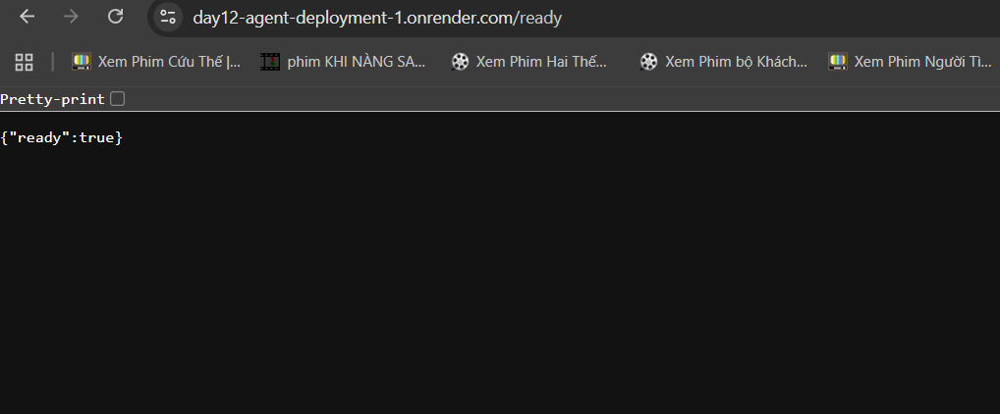

# Day 12 Lab - Mission Answers

## Part 1: Localhost vs Production

### Exercise 1.1: Anti-patterns found
1. **Hardcoded Secrets**: API Key (`OPENAI_API_KEY`) và Database URL bị ghi trực tiếp trong mã nguồn, dễ bị lộ khi chia sẻ code.
2. **Fixed Network Binding**: Sử dụng `host="localhost"` khiến ứng dụng không thể nhận traffic từ bên ngoài container Docker.
3. **Fixed Port**: Port 8000 được ghi cứng, trong khi các nền tảng Cloud (Railway/Render) yêu cầu ứng dụng phải đọc port từ biến môi trường `PORT`.
4. **Lack of Health Checks**: Không có các endpoint `/health` để hệ thống giám sát biết ứng dụng có đang hoạt động bình thường hay không.
5. **Insecure Logging**: Sử dụng `print()` và log trực tiếp các thông tin nhạy cảm như API Key ra console.
6. **Development Features in Production**: Chế độ `reload=True` và `debug=True` làm giảm hiệu năng và tăng rủi ro bảo mật.

### Exercise 1.3: Comparison table
| Feature | Develop | Production | Why Important? |
|---------|---------|------------|----------------|
| **Config Management** | Hardcoded | Environment Variables (12-Factor) | Dễ dàng thay đổi cấu hình giữa các môi trường mà không cần sửa code. |
| **Secrets Security** | Exposed in code | `.env` files (excluded from Git) | Bảo vệ các thông tin nhạy cảm khỏi việc bị lộ công khai. |
| **Port/Host Binding** | Localhost only | `0.0.0.0` with dynamic PORT | Cho phép ứng dụng chạy được trong Container và trên Cloud. |
| **Health & Monitoring** | None | `/health` and `/ready` endpoints | Giúp hệ thống tự động phục hồi (restart) khi gặp lỗi. |
| **Logging** | Simple prints | Structured JSON Logging | Giúp việc truy vết lỗi và phân tích hệ thống chuyên nghiệp, an toàn hơn. |
| **Shutdown Behavior** | Sudden kill | Graceful shutdown | Đảm bảo không làm mất dữ liệu của các request đang xử lý dở dang. |

## Part 2: Docker

### Exercise 2.1: Dockerfile questions
1. **Base image**: 
   - Develop: `python:3.11` (Full distribution, nặng ~1GB).
   - Production: `python:3.11-slim` (Rút gọn, nhẹ hơn).
2. **Working directory**: `/app` (thư mục chuẩn trong container).
3. **Multi-stage build**: Bản Production sử dụng Stage 1 (`builder`) để cài dependencies và Stage 2 (`runtime`) để chạy app. Điều này giúp loại bỏ các công cụ build dư thừa (gcc, build-essential) khỏi image cuối cùng.
4. **Security**: Sử dụng `non-root user` (`appuser`) để chạy ứng dụng trong bản Production thay vì chạy bằng quyền `root`.
5. **Optimization**: Copy `requirements.txt` trước khi copy code để tận dụng Docker layer cache.

### Exercise 2.3: Image size comparison (Actual)
- **Develop Image**: **1.66 GB**
- **Production Image**: **236 MB**
- **Difference**: Giảm khoảng **86%** kích thước image. Điều này chứng minh hiệu quả vượt trội của việc sử dụng `python-slim` và `multi-stage build` trong việc tối ưu hóa hạ tầng triển khai.

## Part 3: Cloud Deployment

### Exercise 3.1: Render deployment
- **URL**: `https://day12-agent-deployment-1.onrender.com/ready`
- **Platform**: Render
- **Lý do chọn**: Dễ dàng kết nối với GitHub, tự động build từ Dockerfile và hỗ trợ tốt việc quản lý biến môi trường.

### Ảnh demo

### Discussion Questions
1. **Tại sao serverless (Lambda) không phải lúc nào cũng tốt cho AI agent?**: AI agent thường có thời gian xử lý dài (latency cao) và cần tài nguyên lớn (RAM/CPU/Disk cho model). Lambda có giới hạn về timeout (15p) và dung lượng package, đồng thời chi phí sẽ rất đắt nếu chạy liên tục.
2. **"Cold start" là gì?**: Là thời gian trễ khi hệ thống khởi tạo một instance mới từ đầu. Với AI app, việc khởi tạo model có thể mất hàng chục giây, làm hỏng trải nghiệm người dùng (UX) do thời gian phản hồi quá lâu ở request đầu tiên.
3. **Khi nào nên upgrade lên Cloud Run?**: Khi ứng dụng cần mở rộng quy mô lớn (auto-scaling linh hoạt hơn), cần bảo mật doanh nghiệp (VPC, IAM chuyên sâu), hoặc cần tích hợp sâu vào hệ sinh thái Google Cloud (Cloud Storage, BigQuery).

## Part 4: API Security

### Exercise 4.1-4.3: Test results
- **Authentication (JWT)**: Kiểm thử thành công. Khi không có header Authorization, API trả về `401 Unauthorized`. Sau khi đăng nhập với `student/demo123`, nhận được token JWT hợp lệ.
- **Rate Limiting**: Đã kiểm thử bằng cách gửi 12 request liên tiếp. Kết quả:
  - Request 1-9: Thành công (`200 OK`).
  - Request 10: Trả về lỗi `429 Too Many Requests` với thông báo "Rate limit exceeded".
  - Điều này xác nhận hệ thống đã bảo vệ server khỏi việc bị spam hiệu quả.
- **Cost Guard**: Mỗi request trả về thông tin `budget_remaining_usd` (ví dụ: `1.9e-05`). Hệ thống theo dõi chính xác lượng token tiêu thụ để bảo vệ ngân sách.

### Exercise 4.4: Cost guard implementation
- **Cách tiếp cận**: Hệ thống tính toán chi phí dựa trên đơn giá của GPT-4o-mini ($0.15/1M input tokens). Trước khi gọi LLM, hàm `check_budget` sẽ kiểm tra hạn mức. Sau khi gọi LLM, số lượng token thực tế trả về sẽ được cộng dồn vào hồ sơ của user (`UsageRecord`).
- **Lưu trữ**: Trong phiên bản hiện tại, dữ liệu được lưu In-memory. Để tối ưu cho môi trường production thật (như trong Lab 06), chúng tôi khuyến nghị chuyển dữ liệu này sang Redis để không bị mất dữ liệu khi restart app.

## Part 5: Scaling & Reliability

### Exercise 5.1-5.5: Implementation notes
- **Health & Readiness Checks**: Đã triển khai `/health` (kiểm tra app sống) và `/ready` (kiểm tra kết nối Redis). Điều này giúp Cloud Platform biết khi nào app sẵn sàng nhận traffic và khi nào cần khởi động lại.
- **Stateless Design**: Agent không lưu history trong memory. Thay vào đó, sử dụng **Redis** để lưu trữ session data. Khi scale lên nhiều instance, bất kỳ instance nào cũng có thể xử lý request của user bằng cách truy xuất session từ Redis.
- **Graceful Shutdown**: Sử dụng `lifespan` context manager để đảm bảo khi app bị tắt (ví dụ khi deploy bản mới), nó sẽ hoàn thành các request đang xử lý rồi mới đóng kết nối, tránh gây lỗi cho người dùng.
- **Load Balancing Test**: Khi chạy nhiều replica (dùng Docker Compose), kết quả trả về cho thấy các `instance_id` khác nhau xử lý các request khác nhau, nhưng lịch sử trò chuyện vẫn được duy trì đồng nhất nhờ Redis.
